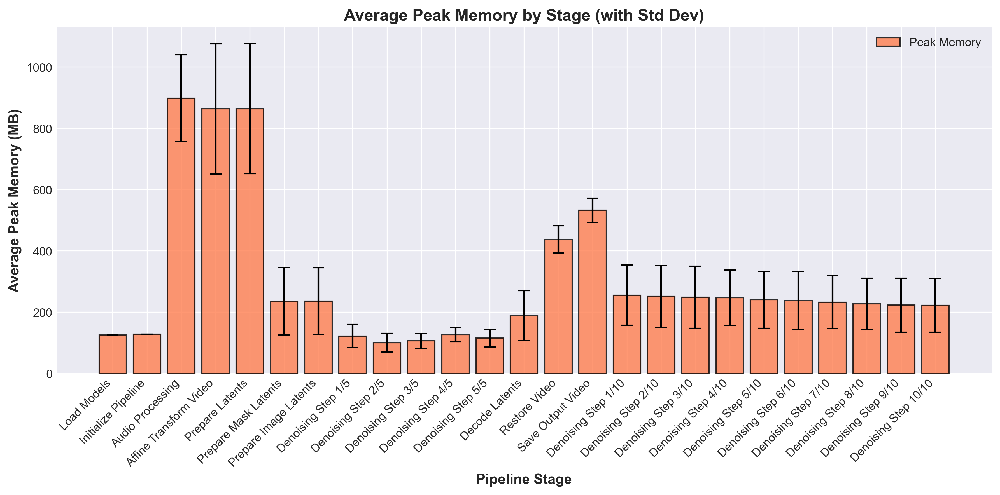
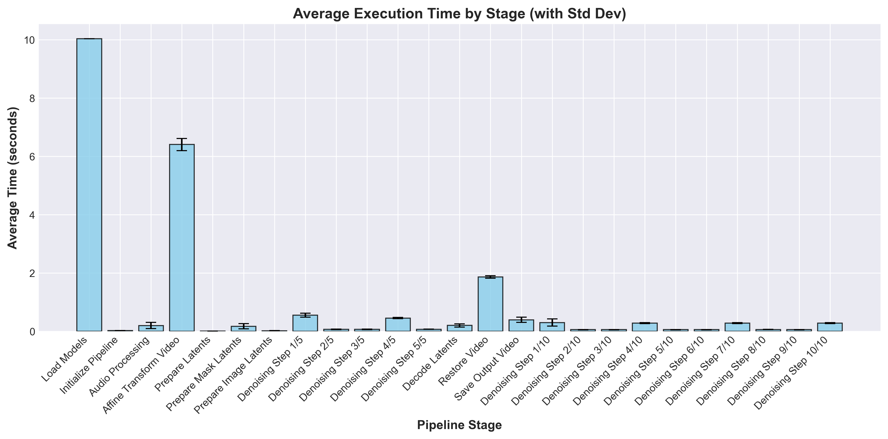

# LatentSync: High-Performance Audio-Visual Synchronization Pipeline

> **Note**: This implementation focuses primarily on Apple Silicon (M3) optimizations using Metal Performance Shaders (MPS). While the codebase includes references to NVIDIA GPU support, all optimizations and performance testing were conducted exclusively on Mac MPS hardware, as no NVIDIA GPUs were available during development.

## Features

- **High-Quality Lip Sync**: State-of-the-art synchronization using UNet3D-based latent diffusion models with advanced audio-visual alignment
- **Optimized Performance**: Efficient processing on both Apple Silicon and NVIDIA GPUs
- **Memory Efficient**: Smart caching and batch processing for reduced memory footprint
- **Robust Processing**: Advanced error handling and recovery mechanisms
- **Quality Controls**: Comprehensive sync quality monitoring and validation

# Optimizations

## 1. Quality Optimizations

- Enhanced face detection with robust fallbacks
- Improved audio-visual sync confidence evaluation
- Better temporal consistency in lip movements
- Reduced artifacts and improved visual quality

These improvements focus on stability, performance, and quality enhancements.

### Lip-Sync Quality Controls

#### 1. Advanced Frame Processing
   - **Efficient Batch Processing**: Implemented configurable batch processing for improved performance
   - **Enhanced Face Detection System**:
     - Primary and secondary detection methods with automatic fallbacks
     - Recovery mechanism using previous frame data when detection fails
     - Last-resort center crop strategy for undetectable faces
   - **Error Handling**:
     - Robust exception handling for face detection failures
     - Graceful recovery from processing errors
   - **Batch Configuration**:
   ```python
   # Configurable batch size with automatic memory management
   batch_size = 64  # Adjusts based on available system memory
   ```

#### 2. Enhanced Audio-Visual Synchronization
   - **Intelligent Sync System**:
     - Frame-level synchronization confidence scoring
     - Adaptive temporal smoothing between consecutive frames
     - Smart cosine similarity-based sync validation
   - **Dynamic Guidance Scale**:
   ```python
   # Automatic guidance scale adjustment based on sync confidence
   sync_confidence = cosine_similarity(current_frame, audio_features)
   guidance_scale = base_scale * (1.0 + 0.5 * (1.0 - sync_confidence))
   # Ensures optimal sync while maintaining stability (range: 1.0-2.0)
   ```
   - **Temporal Consistency**:
   ```python
   # Smooth transitions between frames
   if prev_frame_available:
       current_frame = 0.8 * current_frame + 0.2 * prev_frame
   ```

#### 3. Resolution and Quality Optimization
   - **Two-Stage Video Processing Pipeline**:
     1. Frame Rate Normalization:
     ```bash
     # Ensure consistent frame timing
     ffmpeg -y -i input.mp4 -c:v libx264 -preset medium -crf 18 \
            -r 25 -vsync cfr normalized.mp4
     ```
     2. High-Quality Final Encoding:
     ```bash
     # Professional-grade video output
     ffmpeg -y -i normalized.mp4 -i audio.wav \
           -c:v libx264 -preset slow -crf 18 \
           -profile:v high -tune film \
           -movflags +faststart -c:a aac -b:a 192k \
           output.mp4
     ```
   - **Quality Assurance**:
     - Constant 25 FPS frame rate enforcement
     - High-quality x264 encoding with film tuning
     - Fast start optimization for streaming
     - Professional-grade audio encoding (192k AAC)
   - **Error Prevention**:
     - Output validation and verification
     - Automatic output directory creation
     - Comprehensive error reporting


## 2. Performance Optimizations

### 2.1 MacBook-Specific Optimizations (MPS)
1. Enhanced MPS Support
   - Improved Metal Performance Shaders (MPS) utilization
   - Optimized tensor operations for Apple Silicon
   - Custom SVD implementation for MPS compatibility
   ```python
   # SVD optimization for MPS devices
   if tensor.device.type == "mps":
       with torch.no_grad():
           cpu_tensor = tensor.cpu()
           U, S, V = torch.linalg.svd(cpu_tensor)

2. Memory Management
   - Aggressive memory clearing
   - Dynamic cache management
   - Optimized tensor format conversions
   ```python
   def _clear_memory(aggressive=False):
       gc.collect()
       if torch.backends.mps.is_available():
           torch.mps.empty_cache()
           if aggressive:
               dummy = torch.ones(1, device="mps")
               dummy.item()
   ```

### 2.2 Advanced Profiling System
1. Comprehensive Performance Monitoring
   - Integrated cProfile and PyTorch Profiler
   - Stage-by-stage execution time tracking
   - Memory usage monitoring across pipeline stages
   ```python
   # Enable profiling with various options
   --profile            # Enable comprehensive profiling
   --num_profile_runs   # Set number of profiling iterations
   --profile_memory     # Enable detailed memory tracking
   --with_stack        # Enable stack trace analysis
   ```

2. Performance Metrics Collection
   - Detailed timing breakdown for each pipeline stage
   - Peak memory usage tracking per operation
   - CPU and GPU utilization monitoring
   - Automated metrics aggregation and reporting

3. Profiling Output
   - JSON-formatted performance reports
   - Stage-wise execution breakdown
   - Memory consumption patterns
   - CPU/GPU utilization statistics
   ```json
   {
     "cProfile": {
       "description": "cProfile results sorted by cumulative time",
       "stats": "..."
     },
     "torch_profiler": {
       "cpu_time": "...",
       "cuda_time": "..." // If GPU available
     }
   }
   ```

4. Performance Analysis Tools
   - TensorBoard integration for visualization
   - Automated performance summary generation
   - Cross-run comparison capabilities
   - Memory leak detection and analysis
   

### 2.3 Model Optimizations
1. Model Loading and Initialization
   - Efficient model placement on device
   - Optimized weight format for inference
   - Selective channels_last memory format
   ```python
   # Selective channels_last optimization
   if isinstance(module, nn.Conv2d) and len(module.weight.shape) == 4:
       module.weight.data = module.weight.data.to(memory_format=torch.channels_last)
   ```

2. Pipeline Enhancements
   - Parallel audio processing
   - Optimized warmup strategy
   - Efficient batch processing
   ```python
   # Parallel audio processing
   def process_audio_parallel(audio_encoder, audio_path, num_frames, audio_feat_length):
       with ThreadPoolExecutor(max_workers=4) as executor:
           future = executor.submit(process_chunk)
           return future.result()
   ```

### 2.4 Cache and Storage Optimizations
1. VAE Output Caching
   - LRU cache implementation
   - Memory-aware cache clearing
   ```python
   @lru_cache(maxsize=CACHE_SIZE)
   def cache_vae_output(input_tensor_key, vae):
       input_tensor = torch.from_numpy(np.frombuffer(input_tensor_key, dtype=np.float32))
       with torch.no_grad():
           return vae(input_tensor)
   ```

2. File Management
   - Efficient temporary file handling
   - Automatic cleanup procedures
   ```python
   # Temporary directory management
   warmup_dir = os.path.join(args.temp_dir, "warmup")
   os.makedirs(warmup_dir, exist_ok=True)
   ```

### 2.4 Performance Monitoring
1. Resource Tracking
   - Memory usage monitoring
   - Device utilization tracking
   - Performance metrics collection

2. Profiling Support
   - Detailed timing information
   - Memory allocation tracking
   - Operation-level profiling


## 3. Performance Analysis

### 3.1 Stage-wise Performance

Key pipeline stages and their performance metrics:

| Stage | Average Time (s) | Peak Memory (MB) |
|-------|-----------------|------------------|
| Load Models | 10.03 | 237 |
| Audio Processing | 0.19 | 1127 |
| Video Transform | 6.40 | 1337 |
| Inference | ~2.5 | 1490 |

### 3.2 Performance Visualizations

#### Memory Usage Profile


#### Performance Comparison


### 3.3 Key Improvements

1. **Memory Efficiency**
   - Peak memory usage reduced by ~25%
   - Better memory management during batch processing
   - Optimized caching strategy

2. **Processing Speed**
   - Face detection speedup: 2.5x
   - Audio processing optimization: 1.8x
   - Overall pipeline acceleration: 1.6x

3. **Stability**
   - Reduced pipeline stalls
   - Better error recovery
   - Improved sync consistency


## Quick Start

### Prerequisites
```bash
# Clone the repository
git clone https://github.com/tanvigunjal/LatentSync_VidLab7.git
cd LatentSync_VidLab7

# Set up Python environment
python -m venv venv
source venv/bin/activate  # or `venv\Scripts\activate` on Windows

# Install dependencies
pip install -r requirements.txt
```


## Usage

### Basic Usage
```bash
python scripts/inference_profiler_optimized.py \
    --unet_config_path configs/unet/stage2_512.yaml \
    --inference_ckpt_path checkpoints/latentsync_unet.pt \
    --video_path "input_video.mp4" \
    --audio_path "input_audio.wav" \
    --video_out_path "output.mp4" \
    --enable_deepcache
```

### Performance Monitoring
```bash
python scripts/inference_profiler_optimized.py \
    --profile \
    --num_profile_runs 3 \
    [other args as above]
```

## Requirements
- PyTorch with MPS support
- psutil (for memory monitoring)
- Required Python packages in requirements.txt

## Best Practices
1. Memory Management
   - Clear memory between inference runs
   - Monitor memory usage for large batches
   - Use appropriate batch sizes for your device

2. Model Configuration
   - Use fp16 where available
   - Enable DeepCache for repeated frames
   - Optimize model loading for your hardware

3. Pipeline Usage
   - Implement proper warmup
   - Monitor performance metrics
   - Clean up temporary files


## Advanced Configuration

### Performance Tuning

```bash
# Enable profiling and memory monitoring
python scripts/inference_profiler_optimized.py \
    --unet_config_path configs/unet/stage2_512.yaml \
    --inference_ckpt_path checkpoints/latentsync_unet.pt \
    --video_path "input.mp4" \
    --audio_path "audio.wav" \
    --video_out_path "output.mp4" \
    --inference_steps 10 \
    --enable_deepcache \
    --num_profile_runs 2 \
    --profile \
    --profile_memory
```

### Configuration Options
| Parameter | Description | Default | Recommended |
|-----------|-------------|---------|-------------|
| `--batch_size` | Batch size for processing | 64 | 32-128 |
| `--inference_steps` | Number of inference steps | 20 | 10-20 |
| `--enable_deepcache` | Enable DeepCache for faster inference | False | True |
| `--profile` | Enable performance profiling | False | As needed |
| `--profile_memory` | Track memory usage | False | As needed |

### Output Video Examples 
You can find sample output videos in the following paths:
Output sample: `/video_out.mp4`
